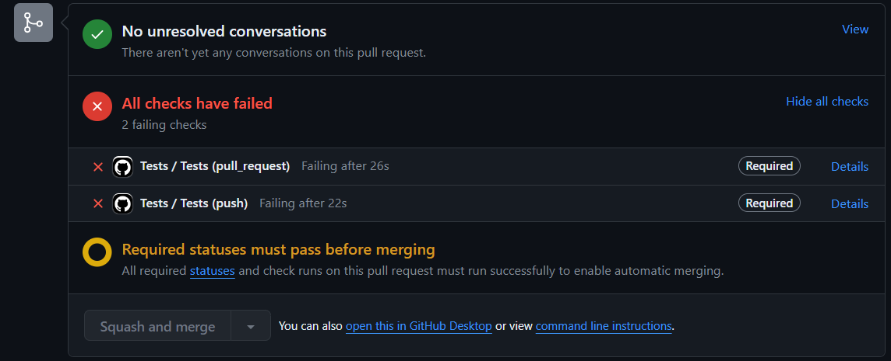
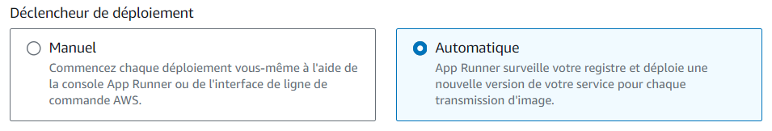
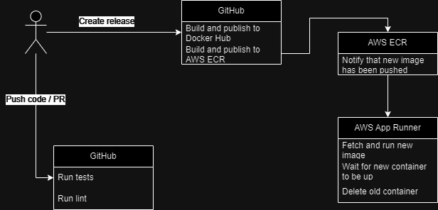

# Projet Alexis Provo

Le but de ce projet était de mettre en place un workflow de release.

Pour ce projet, j'ai utilisé le projet qui avait été fait précedemment en module API. C'est donc cette API qui sera versionnée, publiée et déployée grace à ce workflow.

# Les differents workflows

Afin d'avoir un workflow le plus complet possible, j'ai décidé de créer plusieurs petits workflows différents avec des regles d'éxecutions et des buts différents.

## Tests

Ce workflow est lancé à partir de n'importe quelle branche, à chaque push et à chaque nouvelle pull request.

Celui ci nous permet de de lancer les différentes suites de tests de notre application ainsi que de lancer un lint (analyse du style du code) afin de s'assurer qu'il n'y ait pas de regression suite à des modifications apportées sur une branche / pull request.

Le repository a été configurée de façon a ce qu'une branche puisse être mergée uniquement si ce workflow se déroule avec succès.

Une fois que les tests et le lint sont passés avec succès, qu'il ne reste plus de conversation ouverte sur la PR et que celle-ci est approuvée, celle-ci peut être mergée.

## Release

Ce workflow est lancée uniquement lorsqu'une release est créée sur le repository GitHub, il permet de créer une image Docker et la deployer sur le Docker Hub à partir du [Dockerfile](Dockerfile).

Le workflow se connecte au docker hub en utilisant des identifiants enregistrés sous forme de secrets afin que ceux ci ne soient visibles de personne. Cela est fait en utilisant une action appellée `docker/login-action`

Ensuite, l'image Docker est construite et envoyée sur un repository Docker Hub privé. Pour cela, l'action `docker/build-push-action` est utilisée

## Deployment to ECR

Ce workflow, comme le précedent, est lancée lorsqu'une release est créée. Son but est assez similaire au précedent, mais au lieu de publier l'image Docker sur le Docker Hub, celle-ci est publiée sur un repository AWS ECR privé.

Pour cela, le workflow se connecte à AWS en utilisant des identifiants ,enregistrés sous forme de secrets, en utilisant les actions `aws-actions/configure-aws-credentials` et `aws-actions/amazon-ecr-login`.

Ce workflow est très similaire au précendent, mais la différence est qu'en utilisant l'écosysteme AWS nous pouvons profiter d'autres services qui nous permettent de mettre en place une CI/CD plus complète.

# Déploiement continu

Comme dit précédement, en publiant notre image Docker sur AWS ECR, nous pouvons utiliser d'autres services d'AWS afin d'améliorer notre CI/CD.

Pour cela, j'ai pu créer un service App Runner, celui ci permet de faire tourner des images Docker. En utilisant un ECR privé, cela nous permet de mettre à jour automatiquement notre App Runner avec la derniere version de notre image sans interruption de service.

En utilisant ces différents workflows, il nous suffit de créer une release sur le repository GitHub pour que notre application soit publiée sur un repository Docker Hub (si nous voulons rendre notre application disponible dessus) et de la déployer automatiquement en ligne afin que celle ci soit accessible aux utilisateurs.

# Possibles améliorations

Ces améliorations portent plus sur l'architecture de l'application que du workflow de release, mais ceci impacte aussi la CI/CD.

L'application utilise une base de donnée SQLite, celle ci est créée et initialisée à la création de l'image Docker. Ce qui veut dire qu'à chaque release, la base de donnée est remise à zero.

Pour améliorer cela, il serait possible de séparer la base de donnée de l'application, en faisant tourner la base de donnée sur un autre container ou bien en utilisant un autre service cloud par exemple.
